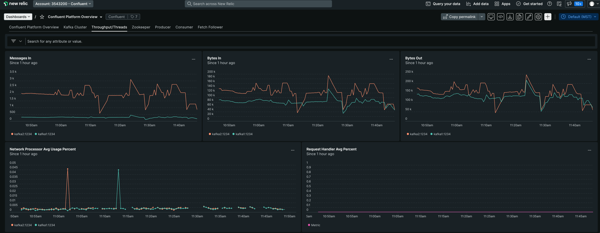

# Overview

This repo demonstrates examples of JMX monitoring stacks that can monitor Confluent Cloud and Confluent Platform.
While Confluent Cloud UI and Confluent Control Center provides an opinionated view of Apache Kafka monitoring, JMX monitoring stacks serve a larger purpose to our users, allowing them to setup monitoring across multiple parts of their organization, many outside of Kafka, and to have a single pane of glass.

This project provides metrics and dashboards for:

- [Confluent Platform with Prometheus and Grafana](jmxexporter-prometheus-grafana)
- [Confluent Platform on Kubernetes with Prometheus and Grafana](jmxexporter-prometheus-grafana/cfk)
- [Confluent Platform with New Relic](jmxexporter-newrelic)
- [Confluent Platform with Prometheus, Metricbeat and Kibana](metricbeat-elastic-kibana)
- [Confluent Platform with Jolokia Agent](jolokia)
- [Confluent Platform with Jolokia, Telegraf and InfluxDB](jolokia-telegraf-influxdb)
- [Confluent Platform with Datadog agent](datadog)
- [Confluent Cloud with Prometheus and Grafana](ccloud-prometheus-grafana)
- [Confluent Cloud with Metricbeat and Kibana](ccloud-metricbeat-elastic-kibana)
- [Confluent Cloud with Opentelemetry and New Relic](ccloud-opentelemetry-newrelic)

## 📊 Dashboards

**Some examples:**

<p float="left">
  
   
   
  
  
  
  
  
</p>

**List of available dashboards for Confluent Platform:**

| Dashboard|Prometheus and Grafana| New Relic |Metricbeat and Kibana| Telegraf and Influx |Datadog|
|-----------------------|----|-----------|--------------------|---------------------|---------------------|
| Kafka Cluster         |yes| yes       | yes| yes                 |yes|
| Zookeeper             |yes| yes       |yes|
| KRaft                 |yes|
| Schema Registry       |yes|           |yes|
| Kafka Connect         |yes|           |yes|
| ksqlDB                |yes|           |yes|
| Producer/Consumer     |yes| yes       |yes|                     |yes|
| Lag Exporter          |yes|           ||
| Topics                |yes|           |yes|
| Kafka Streams         |yes|           ||
| Kafka Streams RocksDB |yes|           ||
| Quotas                |yes|           ||
| TX Coordinator        |yes|           ||
| Rest Proxy            |yes|           ||
| Cluster Linking       |yes|           ||
| Oracle CDC            |yes|           ||
| Confluent RBAC        |yes|           ||
| Replicator            |yes|           ||
| Tiered Storage        |yes|           ||

**List of available dashboards for Confluent Cloud:**

| Dashboard             | Prometheus and Grafana |New Relic|Metricbeat and Kibana|
|-----------------------|------------------------|---------|---------------------|
| Cluster               | yes                    | yes     | yes                 |
| Producer/Consumer     |                        |      | yes                 |
| ksql                  | yes                    |      |                  |
| Billing/Cost tracking | yes                    |      |                  |

## ⚠️ Alerts

Alerts are available for the stacks:

 - [jmxexporter-prometheus-grafana](jmxexporter-prometheus-grafana/assets/prometheus/prometheus-alerts) including alerts on broker, zookeeper and kafka connect.


# How to use with Confluent cp-ansible

To add JMX exporter configurations to [Confluent cp-ansible](https://docs.confluent.io/ansible/current/overview.html), please refer to this [README](jmxexporter-prometheus-grafana/cp-ansible/README.md)

# How to use with Kubernetes and Confluent for Kubernetes Operator (CFK)

To add JMX exporter configurations to your Kubernetes workspace, please refer to this [README](jmxexporter-prometheus-grafana/cfk/README.md)

# How to use with Confluent cp-demo

This repo is intended to work smoothly with [Confluent cp-demo](https://github.com/confluentinc/cp-demo).

Make sure you have enough system resources on the local host to run this.
Verify in the advanced Docker preferences settings that the memory available to Docker is at least 8 GB (default is 2 GB).

**NOTE:** [jq](https://jqlang.github.io/jq/) is required to be installed on your machine to run the demo.

1. Ensure that cp-demo is not already running on the local host.

2. Decide which monitoring stack to demo: and set the `MONITORING_STACK` variable accordingly.

**NOTE:** New Relic requires a [License Key](https://docs.newrelic.com/docs/apis/intro-apis/new-relic-api-keys/#overview-keys) to be added in [_jmxexporter-newrelic/start.sh_](jmxexporter-newrelic/start.sh)

**NOTE:** Datadog requires a [DATADOG_API_KEY](https://docs.datadoghq.com/account_management/api-app-keys/) and [DATADOG_SITE](https://docs.datadoghq.com/getting_started/site/) to be added in [_datadog/start.sh_](datadog/start.sh). Datadog offers 14 day trial for new users.

```bash
# Set only one of these
MONITORING_STACK=jmxexporter-prometheus-grafana
MONITORING_STACK=metricbeat-elastic-kibana
MONITORING_STACK=jmxexporter-newrelic
MONITORING_STACK=jolokia
MONITORING_STACK=jolokia-telegraf-influxdb
MONITORING_STACK=datadog
```

3. Clone `cp-demo` and checkout a branch.

```bash
# Example with CP-DEMO 7.6.1 version (all branches starting from 7.2.0 have been tested)
CP_DEMO_VERSION=7.6.1-post

[[ -d "cp-demo" ]] || git clone https://github.com/confluentinc/cp-demo.git
(cd cp-demo && git fetch && git checkout $CP_DEMO_VERSION && git pull)
```

4. Clone `jmx-monitoring-stacks` and checkout main branch.

```bash
[[ -d "jmx-monitoring-stacks" ]] || git clone https://github.com/confluentinc/jmx-monitoring-stacks.git
(cd jmx-monitoring-stacks && git fetch && git checkout main && git pull)
```

5. Start the monitoring solution with the STACK selected. This command also starts cp-demo, you do not need to start cp-demo separately.

```bash
${MONITORING_STACK}/start.sh
```

6. Stop the monitoring solution. This command also stops cp-demo, you do not need to stop cp-demo separately.

```bash
${MONITORING_STACK}/stop.sh
```

# How to use with Apache Kafka client applications (producers, consumers, kafka streams applications)

For an example that showcases how to monitor Apache Kafka client applications, and steps through various failure scenarios to see how they are reflected in the provided metrics, see the [Observability for Apache Kafka® Clients to Confluent Cloud tutorial](https://docs.confluent.io/cloud/current/get-started/examples/ccloud-observability/docs/index.html).

# How to use with a minimal configuration: DEV-toolkit

[](https://gitpod.io/#https://github.com/confluentinc/jmx-monitoring-stacks/)

To run a lightweight dev environment:

1. `cd dev-toolkit`
2. Put your new dashboards into the `grafana-wip` folder
3. `start.sh` -> It will create a minimal environment with a KRaft cluster, prometheus, grafana and a spring based java client
4. For Grafana, go to http://localhost:3000, login with _admin/password_
5. `stop.sh`

## Run with profiles

To add more use cases, we are leveraging the docker profiles. 

To run replicator scenario, i.e. `start.sh --profile replicator`. It's possible to combine profiles as well, i.e. `start.sh --profile schema-registry --profile ksqldb`.

Currently supported profiles:
- replicator 
- schema-registry
- ksqldb
- consumer (with kafka-lag-exported included)
- clientsreduced (kafka clients with a limited number of metrics exposed)

## FAQ

- What if I need more components?

More docker-compose envs will be released in the future, in the meantime you can use [Kafka Docker Composer](https://github.com/sknop/kafka-docker-composer)

- What if I need more prometheus jobs?

You can add them to the `start.sh`, i.e.

```
# ADD client monitoring to prometheus config
cat <<EOF >> assets/prometheus/prometheus-config/prometheus.yml

  - job_name: 'spring-client'
    static_configs:
      - targets: ['spring-client:9191']
        labels:
          env: "dev"
EOF
```

You can also change the prometheus configuration [here](https://github.com/confluentinc/jmx-monitoring-stacks/blob/main/jmxexporter-prometheus-grafana/assets/prometheus/prometheus-config/prometheus.yml).