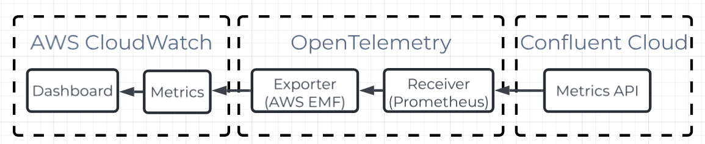

# Confluent Cloud monitoring on AWS CloudWatch

## Architecture



## Prerequisites

Before getting started, ensure you have:

- OpenTelemetry configured with the necessary credentials to write to AWS CloudWatch
- Generated Confluent Cloud API key and secret
- Completed the configuration in `otel-collector-config.yaml`


## Deployment Options

Choose one of the following deployment methods based on your infrastructure setup:

### 1. Run docker-compose


Ideal for environments with access to Docker Compose and greater control over configuration (i.e. AWS EC2):

```sh
docker-compose up -d
```

### 2. Custom Docker Image (Recommended for AWS ECS, Kubernetes)

This is useful for an environment where there isn't much control of the Docker configuration. (i.e. AWS ECS, Kubernetes)

- Build the image

```sh
bash build-docker-image.sh
```

- Upload the image to your preferred repository (e.g., AWS ECR, Docker Hub)
- Pull and deploy the image in your container environment


## Dashboard Setup

To set up the monitoring dashboard:

1. Locate the JSON file in this repository: dashboard/confluent-kafka.json
2. If you modified the exporters.awsemf.namespace in otel-collector-config.yaml, update all instances of it in the JSON file
3. Replace all occurrences of lkc-7d51wo with your specific cluster ID in the JSON file
4. Import the JSON into your AWS CloudWatch dashboard

## Limitations

- This dashboard only shows Conflent Cloud clusters. Other comopnents such as Connectors, Ksql, Flink and Schema Registry are not supported yet.

