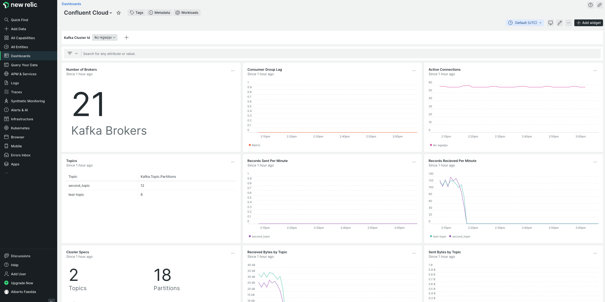

# Confluent Cloud Monitoring with OpenTelemetry Collector and New Relic Cloud

## Prerequisites

### New Relic

You need to create a [New Relic account](https://newrelic.com/signup). 

#### License Key

Once you have logged in to your account, you need to collect your `Ingest Key` which will be needed in the next steps. You can find it on your New Relic UI, from your `Profile` - `API Keys` menu. Find your `INGEST - LICENSE` | `License Key` and then `Copy Key` from the 3 dots options.   

---
### Confluent Cloud

Assuming you have access to Confluent Cloud and have a Kafka Cluster running, you need to create some API Keys needed for this configuration. 

#### Cloud API Key

You create a Cloud API Key in different ways: 

- `Terraform provider`: It is recommended to create Service Accounts and API Keys in an automated way and the Confluent Terraform provider allows us to do so: 
    - [Creation of a Service Account](https://registry.terraform.io/providers/confluentinc/confluent/latest/docs/resources/confluent_service_account#example-usage)
    - [Creation of a Cloud API Key](https://registry.terraform.io/providers/confluentinc/confluent/latest/docs/resources/confluent_api_key#example-cloud-api-key)
    - [Assign MetricsViewer role to Service Account](https://registry.terraform.io/providers/confluentinc/confluent/latest/docs/resources/confluent_role_binding#example-usage)
- `Confluent CLI`: You can find all the steps to create a Service Account, a Cloud API Key and assign a MetricsViewer role from the CLI in [this](https://docs.confluent.io/cloud/current/monitoring/metrics-api.html#metrics-quick-start) documentation. 
- `Cloud GUI`: From the hamburger menu on the upper right corner of your browser select `Cloud API Keys` - from here select `Add Key`, then select `Granular Access` and you can `Create a new Service Account` if you do not already have one. Once you create the Service Account, you’ll get an `API Key pair`.  Make sure you download it and store it somewhere secure (e.g. a `Key Management System`). Going back to the hamburger menu, from the `Accounts & Access` management you can assign the new Service Account a `role`, in this case the `MetricsViewer` role. 

#### Cluster API Key

Similarly to the Cloud API Key, you can create a Cluster API Key in different ways: 

- `Terraform Provider`: An automated creation of Service Accounts and API Keys would be the recommended choice. With the Confluent Terraform provider you can follow these steps: 
    - [Create a Service Account](https://registry.terraform.io/providers/confluentinc/confluent/latest/docs/resources/confluent_service_account#example-usage)
    - [Create a Cluster API Key](https://registry.terraform.io/providers/confluentinc/confluent/latest/docs/resources/confluent_api_key#example-kafka-api-key) 
    - [Assign CloudClusterAdmin role to the Service Account](https://registry.terraform.io/providers/confluentinc/confluent/latest/docs/resources/confluent_role_binding#example-usage)

- `Confluent CLI`: From the CLI you need to follow these steps:  

Login: 
```sh
confluent login
```

Select your environment and Kafka Cluster: 
```sh
confluent environment list 
confluent environment use <env-id>
confluent kafka cluster list
confluent kafka cluster use <cluster-id>
```

Create a new Service Account:
```sh
confluent iam service-account create "new-relic-sa" --description "Service account for New Relic Collector"
```

Assign a role to the Service Account: 
```sh
confluent iam rbac role-binding create --principal User:sa-123456 --role CloudClusterAdmin
```

Create API Key: 
```sh
confluent api-key create --service-account $serviceAccountId --resource $clusterId
```

- `Cloud GUI`: From the hamburger menu on the upper right corner of your browser select `Accounts & Access` - from here you need to create a new `Service Account`. Once you have created the Service Account, you can assign it a `role` by selecting the `Access` tab - you can assign it a role of `CloudClusterAdmin` for your Kafka cluster. 

---
### Virtual Machine

For this example I am working on Azure Cloud.  
Create a `Linux Virtual Machine` on your `VNet` (I’m using `Ubuntu v20.04`), with access to Confluent Cloud. Make sure it has `GoLang` installed (version should be `1.19.x`) and `make (sudo apt install make)` is also installed to build the collector.  

---
## Open Telemetry Collector

You need to clone the following GitHub repository and build the Collector using make.
```sh
git clone https://github.com/4demos/opentelemetry-collector-contrib.git

cd opentelemetry-collector-contrib

make otelcontribcol
```


If the make command returns an error like the following:

```sh
build github.com/Azure/azure-sdk-for-go/sdk/azcore: cannot load github.com/Azure/azure-sdk-for-go/sdk/azcore: no Go source files
```

Build the AzCore SDK and then run the `make` command again: 

```sh
go get -u github.com/Azure/azure-sdk-for-go/sdk/azcore

make otelcontribcol
```

At the end of the build it’ll create a binary in the `./bin` directory.

### Configure Collector

Once your `OpenTelemetry Collector` is built, you can work on the configuration. Create a `config.yaml` file containing the following:

https://github.com/confluentinc/jmx-monitoring-stacks/blob/57c57f759a2c6ab059e870b2dd0fbe9c66a3ebdc/ccloud-opentelemetry-newrelic/assets/newrelic/config.yaml#L1-L59


You need to replace the highlighted placeholders with the `API Key pairs` created previously, your `Confluent Cloud` cluster information (`bootstrap url` and `cluster id`), the `OTLP url` for New Relic and the `New Relic license key`.

#### OTLP Endpoint

Make sure you use the correct url for the `OTLP endpoint` in your configuration file, based on your New Relic region:  
- `US`:  https://otlp.nr-data.net:4317
- `EU`: https://otlp.eu01.nr-data.net:4317


---
## New Relic Dashboard

You can find [here](https://github.com/newrelic/newrelic-quickstarts/blob/main/dashboards/confluent-cloud/confluent-cloud.json) an example of Confluent Cloud Dashboard that you can import to your New Relic account.  
You need to update the dashboard JSON file with your `accountId` information as it is set to 0 in multiple places. You will also find an `accountIds` array at the bottom of the dashboard which also needs to include your accountId.  

### Import Dashboard with Terraform

Create a new dir for your Terraform configuration.
Save your dashboard to `dashboards/cc-dashboard.json`.  
Create the Terraform configuration `main.tf` which will contain your configuration as below: 

https://github.com/confluentinc/jmx-monitoring-stacks/blob/57c57f759a2c6ab059e870b2dd0fbe9c66a3ebdc/ccloud-opentelemetry-newrelic/assets/terraform/main.tf#L1-L33

--- 

 
