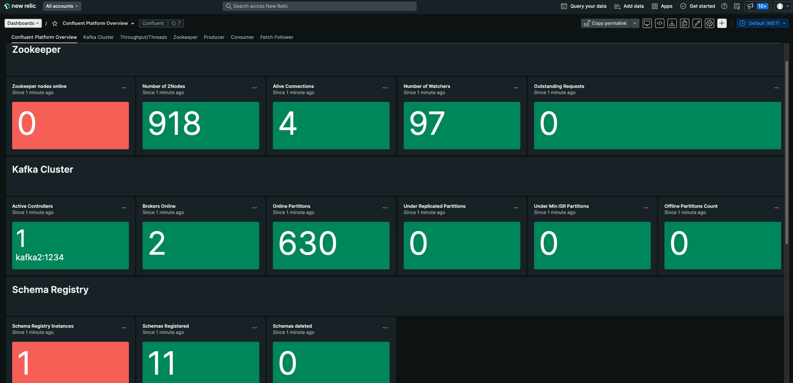

# JMX Exporters and New Relic stack

## New Relic dashboards
Copy the [example dashboard](assets/newrelic/cpdashboard.json) into your New Relic account replacing `"<YourAccountID>"` with your [Account ID](https://docs.newrelic.com/docs/accounts/accounts-billing/account-structure/account-id/)

### Confluent Platform overview

### Confluent Platform overview

### Zookeeper cluster

