# Prometheus and Grafana stack

## Grafana dashboards

### Confluent Platform overview

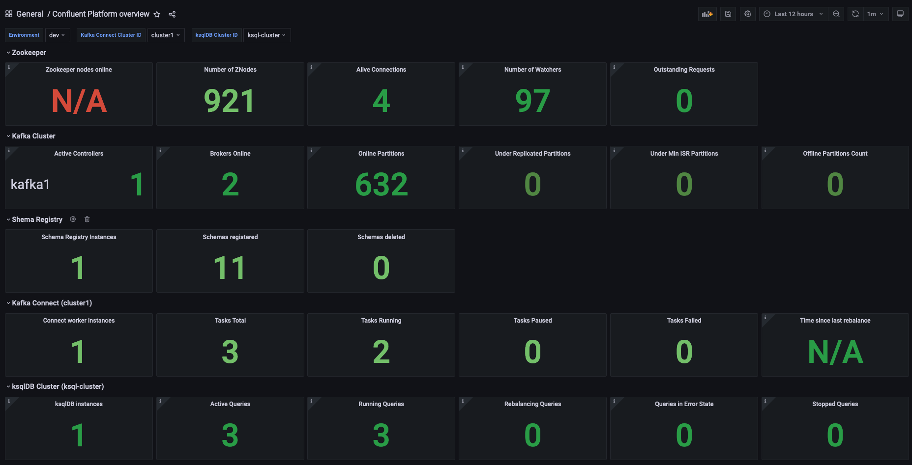

### Zookeeper cluster

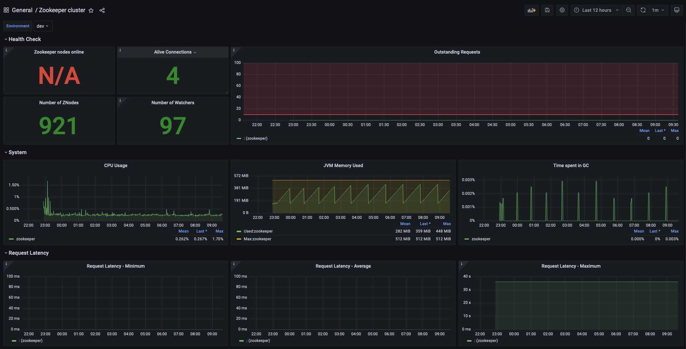

### Kafka cluster

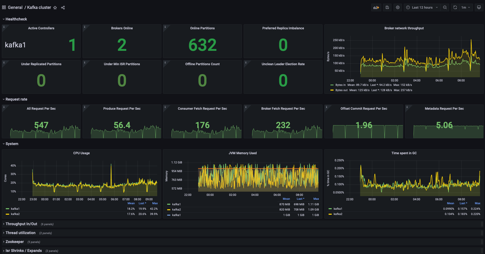
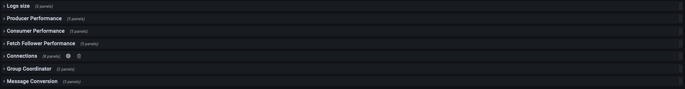

### Kafka topics

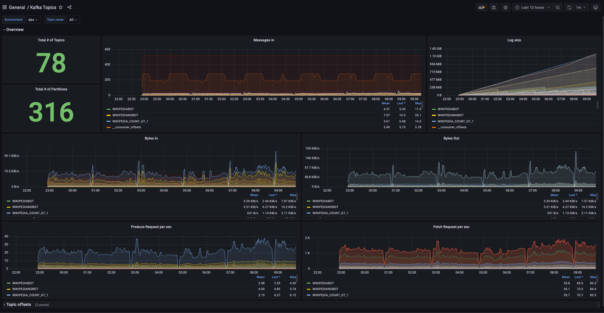

### Kafka quotas
For Kafka to output quota metrics, at least one quota configuration is necessary.

A quota can be configured from the cp-demo folder using docker-compose:
```bash
docker-compose exec kafka1 kafka-configs --bootstrap-server kafka1:12091 --alter --add-config 'producer_byte_rate=10000,consumer_byte_rate=30000,request_percentage=0.2' --entity-type users --entity-name unknown --entity-type clients --entity-name unknown
```

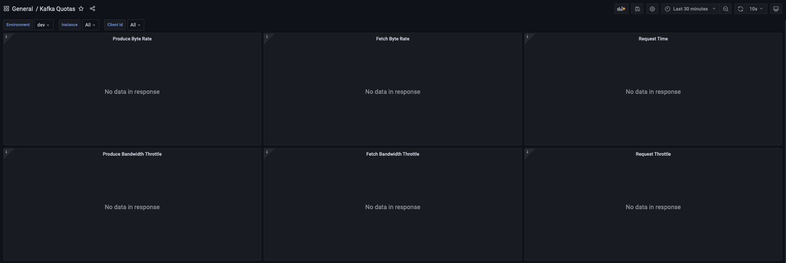

### Schema Registry cluster

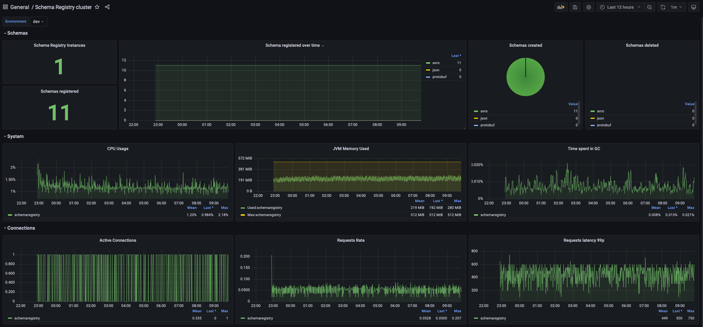

### Kafka Connect cluster

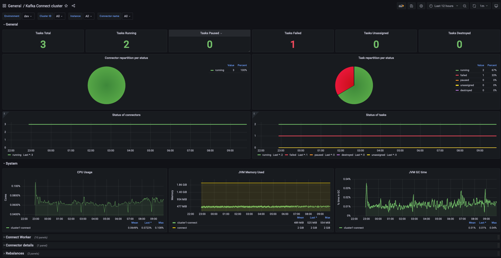


### ksqlDB cluster

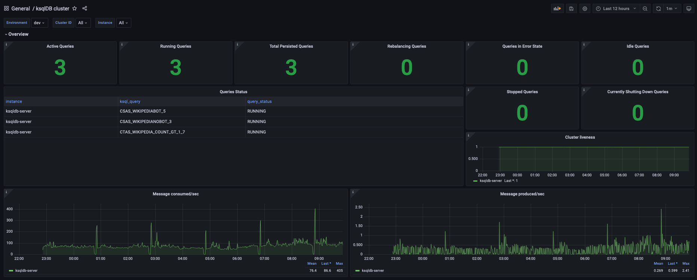
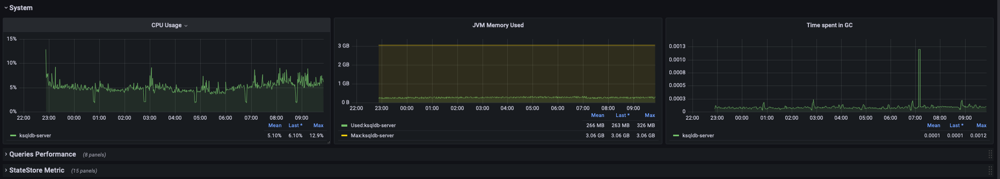

### Kafka Clients

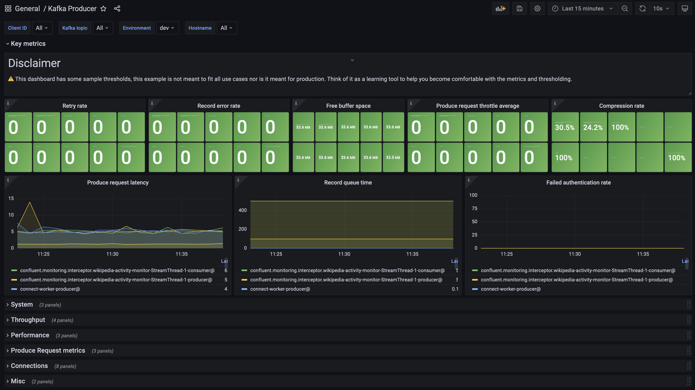

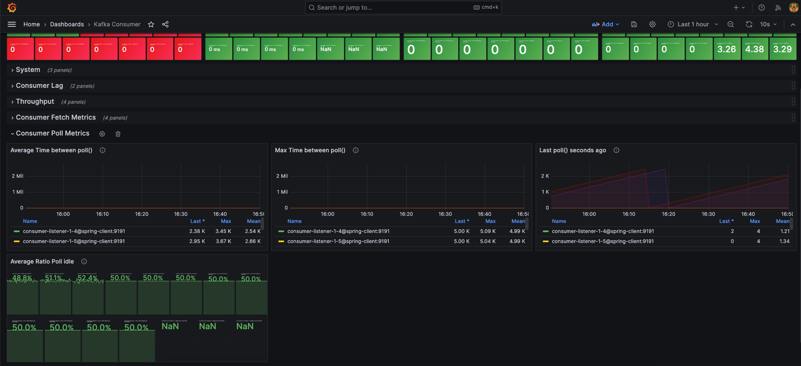

## Integration with `cp-ansible`

When deploying Confluent Platform with `cp-ansible`, Ansible inventories can be used to generate Prometheus configurations for static targets:

Ansible playbook: [cp-ansible/prometheus-config.yml](./cp-ansible/prometheus-config.yml)
Template: [cp-ansible/templates/prometheus.yml.j2](./cp-ansible/templates/prometheus.yml.j2)

Run the following commands providing a `cp-ansible` inventory:

```
ansible-playbook -i hosts.yml prometheus-config.yml
```

And a Prometheus configuration file should be generated:

```
scrape_configs:
  - job_name: "zookeeper"
    static_configs:
      - targets:
          - "zookeeper1:8079"
          - "zookeeper2:8079"
          - "zookeeper3:8079"
        labels:
          env: "dev"
    relabel_configs:
      - source_labels: [__address__]
        target_label: instance
        regex: '([^:]+)(:[0-9]+)?'
        replacement: '${1}'

  - job_name: "kafka"
    static_configs:
      - targets:
          - "kafka1:8080"
          - "kafka2:8080"
          - "kafka3:8080"
        labels:
          env: "dev"
    relabel_configs:
      - source_labels: [__address__]
        target_label: instance
        regex: '([^:]+)(:[0-9]+)?'
        replacement: '${1}'

  - job_name: "schemaregistry"
    static_configs:
      - targets:
          - "schemaregistry1:8078"
          - "schemaregistry2:8078"
        labels:
          env: "dev"
    relabel_configs:
      - source_labels: [__address__]
        target_label: instance
        regex: '([^:]+)(:[0-9]+)?'
        replacement: '${1}'

  - job_name: "connect"
    static_configs:
      - targets:
          - "connect1:8077"
          - "connect2:8077"
        labels:
          env: "dev"
    relabel_configs:
      - source_labels: [__address__]
        target_label: instance
        regex: '([^:]+)(:[0-9]+)?'
        replacement: '${1}'

  - job_name: "ksqldb"
    static_configs:
      - targets:
          - "ksqldbserver1:8077"
          - "ksqldbserver2:8077"
        labels:
          env: "dev"
    relabel_configs:
      - source_labels: [__address__]
        target_label: instance
        regex: '([^:]+)(:[0-9]+)?'
        replacement: '${1}'
```

This configuration can be added to the Prometheus config file.
Once Prometheus is restarted with this configuration, targets will be scrapped.

## Integration with `Confluent for Kubernetes` using the `kube-prometheus-stack`

The [cfk](./cfk) folder contains a Prometheus PodMonitor that will query the JMX metrics for all components of the Confluent Platform.  

The Grafana dashboards need to be updated to use labels provided by Confluent for Kubernetes rather than the custom Prometheus labels for cp-demo.
Use the `cfk/update-dashboards.sh` script to create a new set of Grafana dashboards with renamed labels, then add the Grafana dashboards to Kubernetes.

Adding a Grafana dashboard as a ConfigMap:
```
kubectl create configmap grafana-zookeeper-cluster --from-file=jmxexporter-prometheus-grafana/cfk/dashboards/zookeeper-cluster.json
kubectl label configmap grafana-zookeeper-cluster grafana_dashboard=1
```
