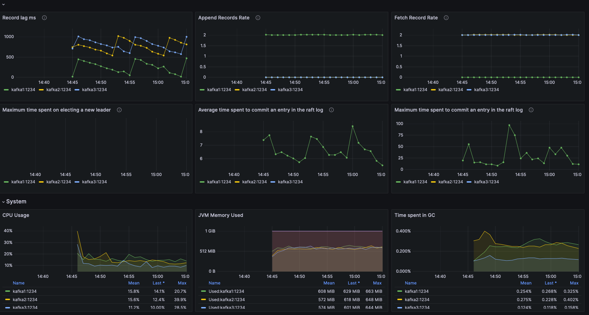

# Prometheus and Grafana stack

List of provided dashboards:

 - [Confluent Platform overview](https://github.com/confluentinc/jmx-monitoring-stacks/blob/main/jmxexporter-prometheus-grafana/README.md#confluent-platform-overview)
 - [Zookeeper cluster](https://github.com/confluentinc/jmx-monitoring-stacks/blob/main/jmxexporter-prometheus-grafana/README.md#zookeeper-cluster)
 - [Kafka cluster](https://github.com/confluentinc/jmx-monitoring-stacks/blob/main/jmxexporter-prometheus-grafana/README.md#kafka-cluster)
 - [Kafka topics](https://github.com/confluentinc/jmx-monitoring-stacks/blob/main/jmxexporter-prometheus-grafana/README.md#kafka-topics)
 - [Kafka clients](https://github.com/confluentinc/jmx-monitoring-stacks/blob/main/jmxexporter-prometheus-grafana/README.md#kafka-clients)
 - [Kafka quotas](https://github.com/confluentinc/jmx-monitoring-stacks/blob/main/jmxexporter-prometheus-grafana/README.md#kafka-quotas)
 - [Kafka lag exporter](https://github.com/confluentinc/jmx-monitoring-stacks/blob/main/jmxexporter-prometheus-grafana/README.md#kafka-lag-exporter)
 - [Kafka transaction coordinator](https://github.com/confluentinc/jmx-monitoring-stacks/blob/main/jmxexporter-prometheus-grafana/README.md#kafka-transaction-coordinator)
 - [Schema Registry cluster](https://github.com/confluentinc/jmx-monitoring-stacks/blob/main/jmxexporter-prometheus-grafana/README.md#schema-registry-cluster)
 - [Kafka Connect cluster](https://github.com/confluentinc/jmx-monitoring-stacks/blob/main/jmxexporter-prometheus-grafana/README.md#kafka-connect-cluster)
 - [ksqlDB cluster](https://github.com/confluentinc/jmx-monitoring-stacks/blob/main/jmxexporter-prometheus-grafana/README.md#ksqldb-cluster)
 - [Kafka streams](https://github.com/confluentinc/jmx-monitoring-stacks/blob/main/jmxexporter-prometheus-grafana/README.md#kafka-streams)
 - [Kafka streams RocksDB](https://github.com/confluentinc/jmx-monitoring-stacks/blob/main/jmxexporter-prometheus-grafana/README.md#kafka-streams-rocksdb)
 - [Oracle CDC source Connector](https://github.com/confluentinc/jmx-monitoring-stacks/blob/main/jmxexporter-prometheus-grafana/README.md#oracle-cdc-source-connector)
 - [Cluster Linking](https://github.com/confluentinc/jmx-monitoring-stacks/blob/main/jmxexporter-prometheus-grafana/README.md#cluster-linking)
 - [Rest Proxy](https://github.com/confluentinc/jmx-monitoring-stacks/blob/main/jmxexporter-prometheus-grafana/README.md#rest-proxy)
 - [KRaft overview](https://github.com/confluentinc/jmx-monitoring-stacks/blob/main/jmxexporter-prometheus-grafana/README.md#kraft)
 - [Confluent RBAC](https://github.com/confluentinc/jmx-monitoring-stacks/blob/main/jmxexporter-prometheus-grafana/README.md#rbac)

### Confluent Platform overview


### Zookeeper cluster


### Kafka cluster


### Kafka topics


### Kafka clients


### Kafka quotas

For Kafka to output quota metrics, at least one quota configuration is necessary.

A quota can be configured from the cp-demo folder using docker-compose:
```bash
docker-compose exec kafka1 kafka-configs --bootstrap-server kafka1:12091 --alter --add-config 'producer_byte_rate=10000,consumer_byte_rate=30000,request_percentage=0.2' --entity-type users --entity-name unknown --entity-type clients --entity-name unknown
```


### Kafka Lag Exporter


### Kafka Transaction Coordinator


### Schema Registry cluster


### Kafka Connect cluster


### ksqlDB cluster


### Kafka streams


### Kafka streams RocksDB 


### Oracle CDC source Connector

To test run [playground example](https://github.com/vdesabou/kafka-docker-playground/tree/master/connect/connect-cdc-oracle19-source) using 
```bash
--enable-jmx-grafana
```


### Cluster Linking


Demo is based on https://github.com/confluentinc/demo-scene/tree/master/cluster-linking-disaster-recovery

To test follow the next steps:

1. Set env:
 ```bash
MONITORING_STACK=jmxexporter-prometheus-grafana
 ```
2. Clone demo cluster linking disaster recovery from confluentinc/demo-scene:
```bash
   [[ -d "clink-demo" ]] || git clone git@github.com:confluentinc/demo-scene.git clink-demo
   (cd clink-demo && git fetch && git pull)
   ```
3. Start the monitoring solution with the STACK selected. This command also starts clink-demo, you do not need to start clink-demo separately.

```bash
${MONITORING_STACK}/cluster-linking/start.sh
``` 

4. Stop the monitoring solution. This command also stops clink-demo, you do not need to stop clink-demo separately.

```bash
${MONITORING_STACK}/cluster-linking/stop.sh
```

### Rest Proxy


### KRaft




### Confluent RBAC


