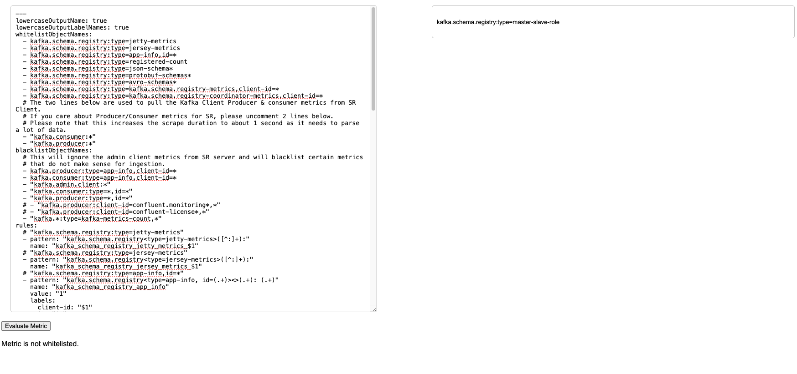
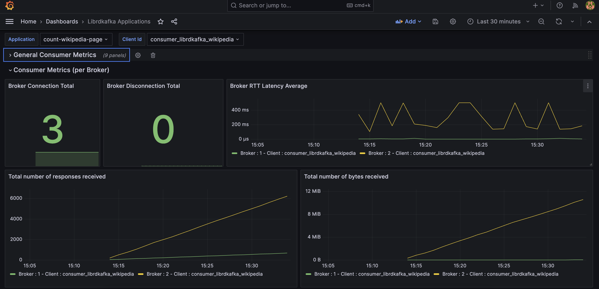
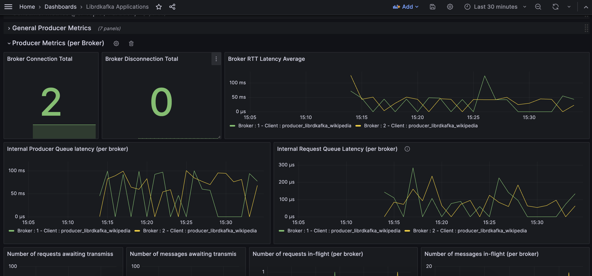
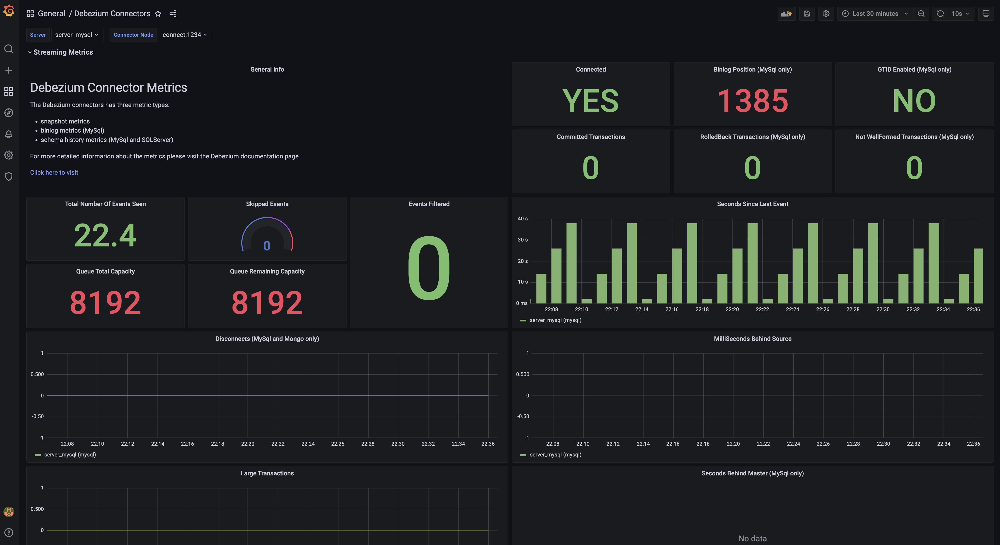
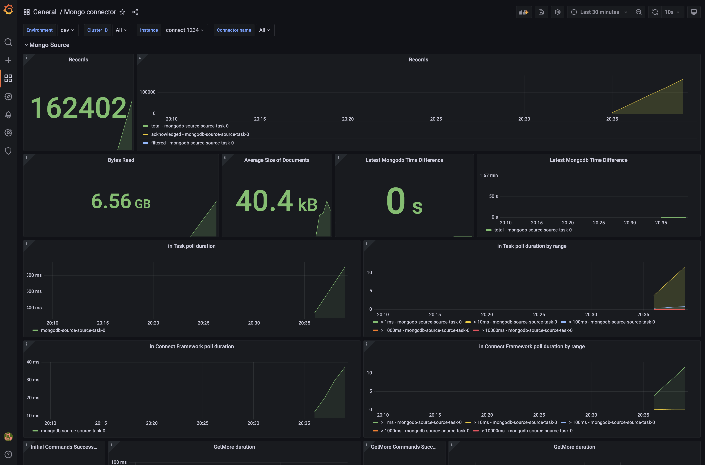
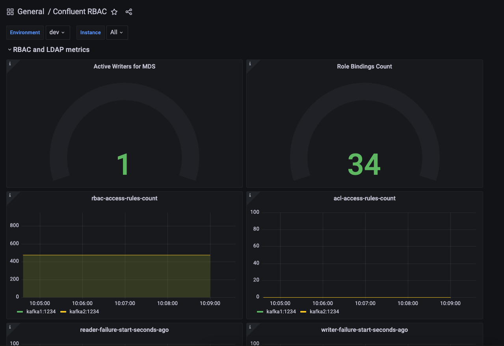
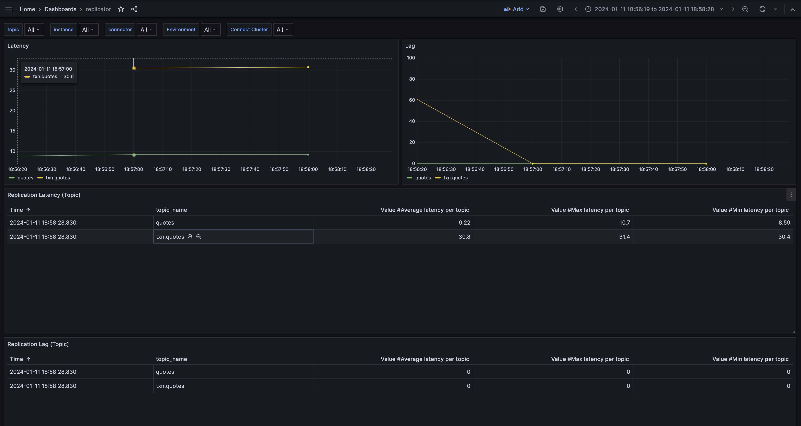
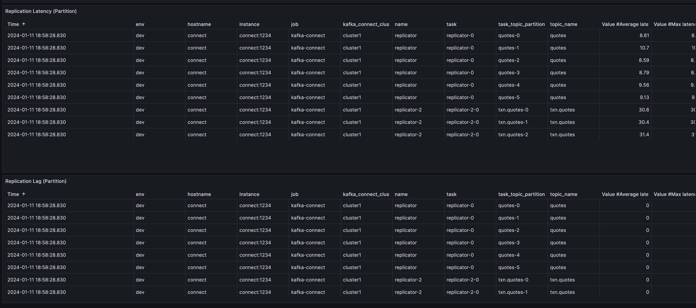
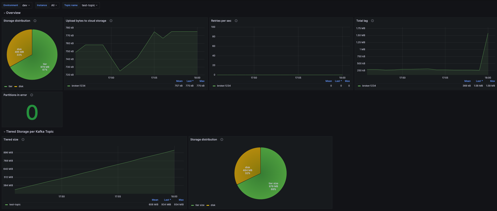
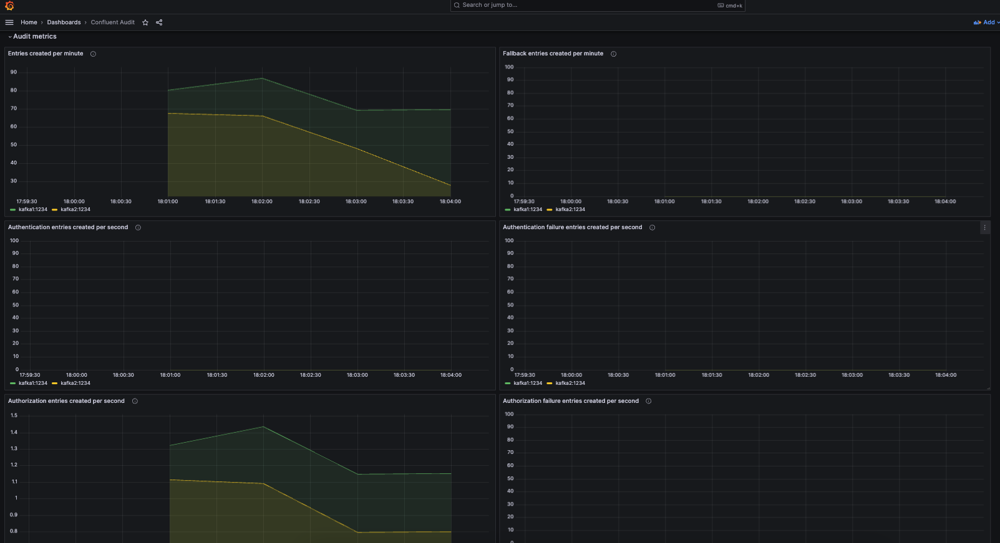

# Prometheus and Grafana stack

After run the demo, for Grafana, go to http://localhost:3000 and then login with _admin/password_

- JMX Exporter 1.1.0
- Prometheus version: 2.47.2
- Grafana version 10.2.0

---
> [!NOTE]
> **JMX Exporter 1.x Dashboards**
>
> Grafana dashboards are supported for JMX Exporter version 1.x.
> 
> If you still use JMX Exporter version < 1.x (example 0.20), you would need to use the dashboards from this folder: [grafana-dashboards-exporter-pre-1.x](https://github.com/confluentinc/jmx-monitoring-stacks/blob/main/jmxexporter-prometheus-grafana/assets/grafana/provisioning/dashboards-old-exporter)
>
---

List of provided dashboards:

 - [Confluent Platform overview _(cp-demo,dev-toolkit)_](https://github.com/confluentinc/jmx-monitoring-stacks/blob/main/jmxexporter-prometheus-grafana/README.md#confluent-platform-overview)
 - [Zookeeper cluster _(cp-demo)_](https://github.com/confluentinc/jmx-monitoring-stacks/blob/main/jmxexporter-prometheus-grafana/README.md#zookeeper-cluster)
 - [Kafka cluster _(cp-demo,dev-toolkit)_](https://github.com/confluentinc/jmx-monitoring-stacks/blob/main/jmxexporter-prometheus-grafana/README.md#kafka-cluster)
 - [Kafka topics _(cp-demo,dev-toolkit)_](https://github.com/confluentinc/jmx-monitoring-stacks/blob/main/jmxexporter-prometheus-grafana/README.md#kafka-topics)
 - [Kafka clients _(cp-demo,dev-toolkit)_](https://github.com/confluentinc/jmx-monitoring-stacks/blob/main/jmxexporter-prometheus-grafana/README.md#kafka-clients)
 - [Kafka quotas _(cp-demo,dev-toolkit)_](https://github.com/confluentinc/jmx-monitoring-stacks/blob/main/jmxexporter-prometheus-grafana/README.md#kafka-quotas)
 - [Kafka lag exporter _(cp-demo,dev-toolkit)_](https://github.com/confluentinc/jmx-monitoring-stacks/blob/main/jmxexporter-prometheus-grafana/README.md#kafka-lag-exporter)
 - [Kafka transaction coordinator _(cp-demo,dev-toolkit)_](https://github.com/confluentinc/jmx-monitoring-stacks/blob/main/jmxexporter-prometheus-grafana/README.md#kafka-transaction-coordinator)
 - [Schema Registry cluster _(cp-demo,dev-toolkit)_](https://github.com/confluentinc/jmx-monitoring-stacks/blob/main/jmxexporter-prometheus-grafana/README.md#schema-registry-cluster)
 - [Kafka Connect cluster _(cp-demo,dev-toolkit)_](https://github.com/confluentinc/jmx-monitoring-stacks/blob/main/jmxexporter-prometheus-grafana/README.md#kafka-connect-cluster)
 - [ksqlDB cluster _(cp-demo,dev-toolkit)_](https://github.com/confluentinc/jmx-monitoring-stacks/blob/main/jmxexporter-prometheus-grafana/README.md#ksqldb-cluster)
 - [Kafka streams _(cp-demo)_](https://github.com/confluentinc/jmx-monitoring-stacks/blob/main/jmxexporter-prometheus-grafana/README.md#kafka-streams)
 - [Kafka streams RocksDB _(cp-demo)_](https://github.com/confluentinc/jmx-monitoring-stacks/blob/main/jmxexporter-prometheus-grafana/README.md#kafka-streams-rocksdb)
 - [Librdkafka based client _(cp-demo)_](https://github.com/confluentinc/jmx-monitoring-stacks/blob/main/jmxexporter-prometheus-grafana/README.md#Librdkafka)
 - [Oracle CDC source Connector](https://github.com/confluentinc/jmx-monitoring-stacks/blob/main/jmxexporter-prometheus-grafana/README.md#oracle-cdc-source-connector)
 - [Debezium source Connectors](https://github.com/confluentinc/jmx-monitoring-stacks/blob/main/jmxexporter-prometheus-grafana/README.md#debezium-cdc-source-connectors)
 - [Mongo source and sink Connectors](https://github.com/confluentinc/jmx-monitoring-stacks/blob/main/jmxexporter-prometheus-grafana/README.md#mongo-source-and-sink-connectors)
 - [Cluster Linking _(dev-toolkit)_](https://github.com/confluentinc/jmx-monitoring-stacks/blob/main/jmxexporter-prometheus-grafana/README.md#cluster-linking)
 - [Rest Proxy _(cp-demo)_](https://github.com/confluentinc/jmx-monitoring-stacks/blob/main/jmxexporter-prometheus-grafana/README.md#rest-proxy)
 - [KRaft overview _(dev-toolkit)_](https://github.com/confluentinc/jmx-monitoring-stacks/blob/main/jmxexporter-prometheus-grafana/README.md#kraft)
 - [Confluent RBAC _(cp-demo)_](https://github.com/confluentinc/jmx-monitoring-stacks/blob/main/jmxexporter-prometheus-grafana/README.md#rbac)
 - [Confluent Replicator _(dev-toolkit)_](https://github.com/confluentinc/jmx-monitoring-stacks/blob/main/jmxexporter-prometheus-grafana/README.md#replicator)
 - [Confluent Tiered Storage](https://github.com/confluentinc/jmx-monitoring-stacks/blob/main/jmxexporter-prometheus-grafana/README.md#tiered-storage)
 - [Confluent Audit _(cp-demo)_](https://github.com/confluentinc/jmx-monitoring-stacks/blob/main/jmxexporter-prometheus-grafana/README.md#confluent-audit)
 - [Flink Cluster](https://github.com/confluentinc/jmx-monitoring-stacks/blob/main/jmxexporter-prometheus-grafana/README.md#flink-cluster)

---
> [!NOTE]
> **Consumer Group Lag**
> 
> Starting with CP 7.5, brokers expose JMX tenant-metrics for consumer lags, see the [documentation](https://docs.confluent.io/platform/current/monitor/monitor-consumer-lag.html#monitor-consumer-lag).
> 
> Consequently, you can either go with the [kafka-lag-exporter](https://github.com/seglo/kafka-lag-exporter) or with the broker built-in tenant metrics.
> For the later one, you need to enable it by setting `confluent.consumer.lag.emitter.enabled = true` in the broker configuration, see the [documentation](https://docs.confluent.io/platform/current/kafka/monitoring.html#consumer-lag-offsets).
> 
> This repository contains both options:
> - Dedicated Kafka lag exporter dashboard
> - Consumer lag visualizations within the consumer dashboard
---

## JMX Exporter UI

**[Experimental]**

You can test JMX metrics using the UI and see if they are matching against a Prometheus ruleset file.

To run the UI:

 - ensure you have Python 3.x install
 - install python dependencies:
```
pip install Flask
```
 - run the UI and then connect to localhost:5000
```
python shared-assets/jmx-exporter-matching-ui/app.py
```
 - play with the UI



### Confluent Platform overview


### Zookeeper cluster


### Kafka cluster


As an alternative, it is also available a definition file to collect only metrics with value at [99th percentile](https://github.com/confluentinc/jmx-monitoring-stacks/blob/main/shared-assets/jmx-exporter/kafka_broker_p99only.yml).


### Kafka topics


### Kafka clients


As an alternative, it is also available a definition file to collect only a limited number of metrics for clients [clients - reduced](https://github.com/confluentinc/jmx-monitoring-stacks/blob/main/shared-assets/jmx-exporter/kafka_client_reduced.yml).

### Kafka quotas

For Kafka to output quota metrics, at least one quota configuration is necessary.

A quota can be configured from the cp-demo folder using docker-compose:
```bash
docker-compose exec kafka1 kafka-configs --bootstrap-server kafka1:12091 --alter --add-config 'producer_byte_rate=10000,consumer_byte_rate=30000,request_percentage=0.2' --entity-type users --entity-name unknown --entity-type clients --entity-name unknown
```


### Kafka Lag Exporter


### Kafka Transaction Coordinator


### Schema Registry cluster


### Kafka Connect cluster


### ksqlDB cluster


### Kafka streams


### Kafka streams RocksDB 


### Librdkafka




### Oracle CDC source Connector

Demo is based on https://github.com/vdesabou/kafka-docker-playground/tree/master/connect/connect-cdc-oracle19-source

To test:
 - From the repo, run [playground example](https://github.com/vdesabou/kafka-docker-playground/tree/master/connect/connect-cdc-oracle19-source) using option _--enable-jmx-grafana_


### Debezium CDC source Connectors



### Mongo source and sink Connectors



### Cluster Linking

To test use dev-toolkit with _clusterlinking_ profile:

1. Start dev-toolkit with

```bash
$ cd dev-toolkit
$ start.sh --profile clusterlinking
```


### Rest Proxy


### KRaft

To test use dev-toolkit with _default_ profile:

1. Start dev-toolkit with

```bash
$ cd dev-toolkit
$ start.sh
```


### Confluent RBAC



### Replicator 

To test follow the next steps:

1. Start dev-toolkit with _replicator_ profile

```bash
$ cd dev-toolkit
$ start.sh --profile replicator
```





### Tiered Storage

To test follow the next steps:

1. Start dev-toolkit with _tieredstorage_ profile

```bash
$ cd dev-toolkit
$ start.sh --profile replicator
```



### Confluent Audit


### Flink Cluster

To test follow instructions exsisting at:
[flink folder](flink/README.md)

