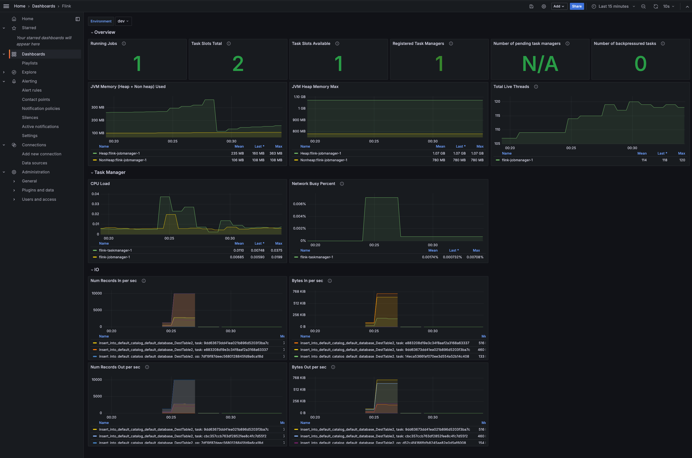

# Dashboard



# Version

This assumes the Flink job and task managers are on [1.20][1]

[1]: https://nightlies.apache.org/flink/flink-docs-release-1.20/docs/ops/metrics/#system-resources

# Setup

1. Setup the following properties in job and task manager

```sh
metrics.reporters: prom
metrics.reporter.prom.factory.class: org.apache.flink.metrics.prometheus.PrometheusReporterFactory
```

For example, in Docker compose,

```sh
version: "2.3"
services:
  jobmanager:
    image: flink-custom:1.20.0.3
    # image: flink:latest
    ports:
      - "8081:8081"
      - "9249:9249"
    command: jobmanager
    volumes:
      - ./log4j/debug.properties:/opt/flink/conf/log4j-console.properties
    environment:
      - |
        FLINK_PROPERTIES=
        jobmanager.rpc.address: jobmanager
        state.backend.type: rocksdb
        metrics.reporters: prom
        metrics.reporter.prom.factory.class: org.apache.flink.metrics.prometheus.PrometheusReporterFactory


  taskmanager:
    image: flink-custom:1.20.0.3
    # image: flink:latest
    depends_on:
      - jobmanager
    ports:
      - "9250:9249"
    command: taskmanager
    scale: 1
    volumes:
      - ./log4j/debug.properties:/opt/flink/conf/log4j-console.properties
    environment:
      - |
        FLINK_PROPERTIES=
        jobmanager.rpc.address: jobmanager
        metrics.reporters: prom
        metrics.reporter.prom.factory.class: org.apache.flink.metrics.prometheus.PrometheusReporterFactory

        taskmanager.numberOfTaskSlots: 2
        state.backend.type: rocksdb
```

2. Setup Prometheus File

## Prometheus

The following setting is required in prometheus.

```
  - job_name: "flink"
    static_configs:
      - targets:
          - "flink-jobmanager-1:9249"
          - "flink-taskmanager-1:9249"
          - "flink-taskmanager-2:9249"
        labels:
          env: "dev"
    metric_relabel_configs:
      - source_labels: [__name__]
        regex: 'flink_jobmanager_Status_JVM_CPU_Time'
        target_label: __name__
        replacement: 'flink_jobmanager_Status_JVM_CPU_Time_total'
      - source_labels: [__name__]
        regex: 'flink_taskmanager_Status_JVM_CPU_Time'
        target_label: __name__
        replacement: 'flink_taskmanager_Status_JVM_CPU_Time_total'
    relabel_configs: 
      - source_labels: [__address__]
        target_label: instance
        regex: '([^:]+)(:[0-9]+)?'
        replacement: '${1}'
```

3. Paste the JSON file for Grafana

Paste flink-cp.json file in the same directory. The datasource name defaults to "prometheus".