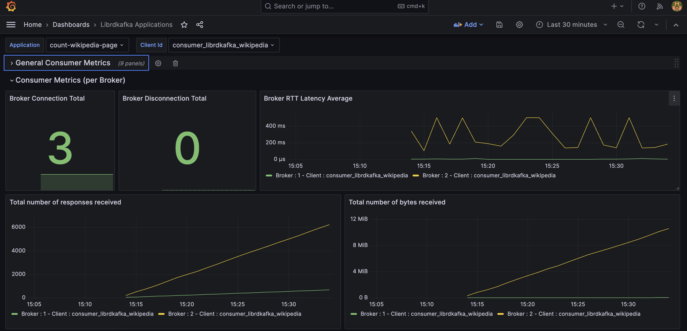
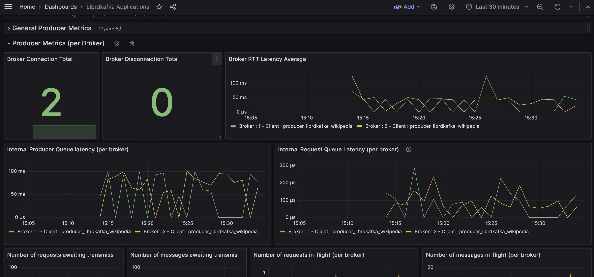

# Librdkafka based client monitoring

## Use case

Each application based on the Librdkafka client can retrieve statistics and expose them in the way it prefers. To achieve this, it must subscribe to the statistics callback, retrieve the JSON containing the metrics, and implement an exposure layer.

Here's an example of a .Net application that accomplishes this:

- `/common` - Contains all the Prometheus statistic handlers.
- `/sum-application` - Contains the .Net Librdkafka application.

This application consumes a Kafka topic `wikipedia.parsed` fed by a component of the `cp-demo`` demo, processes these messages with a state store, and publishes the result to another Kafka topic `agg-wikipedia-page`. Therefore, we have both a Librdkafka consumer and producer.

For more information on the statistics sent by the Librdkafka client, please refer to the documentation [here](https://github.com/confluentinc/librdkafka/blob/master/STATISTICS.md).

The .Net application configures the statistics handler to be called once per second. [./sum-application/config.json](./sum-application/config.json)

## Consumer Metrics

Please find below the list of metrics exposed by the consumer:
[PrometheusConsumerStatisticsHandler.cs](./common/Prometheus/PrometheusConsumerStatisticsHandler.cs)

**General metrics**
| Metrics                            | Description  | Labels  |
|------------------------------------|--------------|---------|
|  kafka_consumed_total              | Total number of messages consumed, excluding ignored messages (due to offset, etc), from Kafka brokers.  |  application_id, client_id       |
|  kafka_bytes_consumed_total        | Total number of bytes received from Kafka brokers.                                                           |  application_id, client_id       |
|  kafka_ops_waiting_queue_total     | Number of ops (callbacks, events, etc) waiting in the queue for the application to serve with rd_kafka_poll().       |  application_id, client_id       |
|  kafka_responses_received_total    | Total number of responses received from Kafka brokers.                                                       |  application_id, client_id       |
|  kafka_bytes_received_total        | Total number of bytes received from Kafka brokers.                                                           |  application_id, client_id       |
|  kafka_rebalance_age               | Time elapsed since the last rebalance (assign or revoke) in milliseconds.                                         |  application_id, client_id       |
|  kafka_rebalance_total             | Total number of rebalances (assign or revoke).                                                               |  application_id, client_id       |

**Broker metrics**
| Metrics                            | Description  | Labels  |
|------------------------------------|--------------|---------|
|  kafka_broker_responses_total      | Total number of responses received.                                                             |  application_id, client_id, broker_id       |
|  kafka_broker_responses_byte_total | Total number of bytes received.                                                                 |  application_id, client_id, broker_id       |
|  kafka_broker_error_total          | Total number of receive errors.                                                                 |  application_id, client_id, broker_id       |
|  kafka_broker_connection_total     | Number of connection attempts, including successful and failed, and name resolution failures.   |  application_id, client_id, broker_id       |
|  kafka_broker_disconnection_total  | Number of disconnects (triggered by broker, network, load-balancer, etc.).                      |  application_id, client_id, broker_id       |
|  kafka_broker_latency_average_ms   | Broker latency / round-trip time in microseconds.                                               |  application_id, client_id, broker_id       |

**Topic metrics**
| Metrics                            | Description  | Labels  |
|------------------------------------|--------------|---------|
|  kafka_topic_batch_size_bytes_average      | Average batch size in bytes.     |  application_id, client_id, topic       |
|  kafka_topic_batch_count_average           | Average batch message count.     |  application_id, client_id, topic       |

**Partition metrics**
| Metrics                            | Description  | Labels  |
|------------------------------------|--------------|---------|
|  kafka_partition_lag                      | Difference between (hi_offset or ls_offset) - max(app_offset, committed_offset). hi_offset is used when isolation.level=read_uncommitted, otherwise ls_offset.     |  application_id, client_id, topic, partition_id       |
|  kafka_partition_message_consumed_total   | Total number of messages consumed, excluding ignored messages (due to offset, etc).                                            |  application_id, client_id, topic, partition_id   |
|  kafka_partition_message_bytes_consumed_total           | Total number of bytes received for received messages.     |  application_id, client_id, topic, partition_id       |

Note that not all fields of the JSON object concerning the consumer are retrieved. Feel free to add more metrics or open a PR if an important metric is missing.

## Producer Metrics

Please find below the list of metrics exposed by the producer:
[PrometheusProducerStatisticsHandler.cs](./common/Prometheus/PrometheusProducerStatisticsHandler.cs)

**General metrics**
| Metrics                            | Description  | Labels  |
|------------------------------------|--------------|---------|
|  kafka_transmitted_message_total        | Total number of messages transmitted (produced) to Kafka brokers                                            |  application_id, client_id       |
|  kafka_transmitted_message_bytes_total  | Total number of message bytes transmitted to Kafka brokers                                                  |  application_id, client_id       |
|  kafka_ops_waiting_queue_total          | Number of ops (callbacks, events, etc) waiting in the queue for the application to serve with rd_kafka_poll().      |  application_id, client_id       |
|  kafka_messages_queue_current           | Current number of messages in producer queues                                                               |  application_id, client_id       |
|  kafka_messages_queue_size_bytes_total  | Current total size of messages in producer queues                                                           |  application_id, client_id       |
|  kafka_message_queue_max                | Maximum number of messages allowed on the producer queues                                                   |  application_id, client_id       |
|  kafka_message_queue_size_bytes_max     | Maximum total size of messages allowed on the producer queues                                               |  application_id, client_id       |
|  kafka_transmitted_request_total        | Total number of requests sent to Kafka brokers                                                              |  application_id, client_id       |
|  kafka_transmited_request_bytes_total   | Total number of bytes transmitted to Kafka brokers                                                          |  application_id, client_id       |

**Broker metrics**
| Metrics                            | Description  | Labels  |
|------------------------------------|--------------|---------|
|  kafka_broker_request_awaiting_total                   | Number of requests awaiting transmission to broker        |  application_id, client_id, broker_id       |
|  kafka_broker_message_awaiting_total                   | Number of messages awaiting transmission to broker        |  application_id, client_id, broker_id       |
|  kafka_broker_request_in_flight_total                  | Number of requests in-flight to broker awaiting response  |  application_id, client_id, broker_id       |
|  kafka_broker_message_in_flight_total                  | Number of messages in-flight to broker awaiting response  |  application_id, client_id, broker_id       |
|  kafka_broker_request_sent_total                       | Total number of requests sent                             |  application_id, client_id, broker_id       |
|  kafka_broker_request_sent_bytes_total                 | Total number of bytes sent                                |  application_id, client_id, broker_id       |
|  kafka_broker_error_total                              | Total number of transmission errors                       |  application_id, client_id, broker_id       |
|  kafka_broker_retries_total                            | Total number of request retries                           |  application_id, client_id, broker_id       |
|  kafka_broker_timeout_total                            | Total number of requests timed out                        |  application_id, client_id, broker_id       |
|  kafka_broker_connection_total                         | Number of connection attempts, including successful and failed, and name resolution failures.           |  application_id, client_id, broker_id       |
|  kafka_broker_disconnection_total                      | Number of disconnects (triggered by broker, network, load-balancer, etc.).                              |  application_id, client_id, broker_id       |
|  kafka_broker_internal_queue_latency_ms                | Internal producer queue latency in microseconds.           |  application_id, client_id, broker_id       |
|  kafka_broker_internal_request_queue_latency_ms        | Internal request queue latency in microseconds. This is the time between a request being enqueued on the transmit (outbuf) queue and the time the request is written to the TCP socket. Additional buffering and latency may be incurred by the TCP stack and network.                                               |  application_id, client_id, broker_id       |
|  kafka_broker_latency_average_ms                       | Broker latency / round-trip time in microseconds.          |  application_id, client_id, broker_id       |

**Topic metrics**
| Metrics                            | Description  | Labels  |
|------------------------------------|--------------|---------|
|  kafka_topic_batch_size_bytes_average      | Average batch size in bytes.     |  application_id, client_id, topic       |
|  kafka_topic_batch_count_average           | Average batch message count.     |  application_id, client_id, topic       |

**Partition metrics**
| Metrics                            | Description  | Labels  |
|------------------------------------|--------------|---------|
|  kafka_partition_transmitted_message_total        | Total number of messages transmitted (produced)      |  application_id, client_id, topic, partition_id       |
|  kafka_partition_transmitted_message_bytes_total  | Total number of bytes transmitted for transmitted messages.         |  application_id, client_id, topic, partition_id   |
|  kafka_partition_message_in_flight_total          | Current number of messages in-flight to/from broker  |  application_id, client_id, topic, partition_id       |
|  kafka_partition_next_expected_ack                | Next expected acknowledged

## Dashboard

Librdkafka Consumer Metrics

Librdkafka Producer Metrics

## Resources

[Librdkafka Statistics](https://github.com/confluentinc/librdkafka/blob/master/STATISTICS.md)