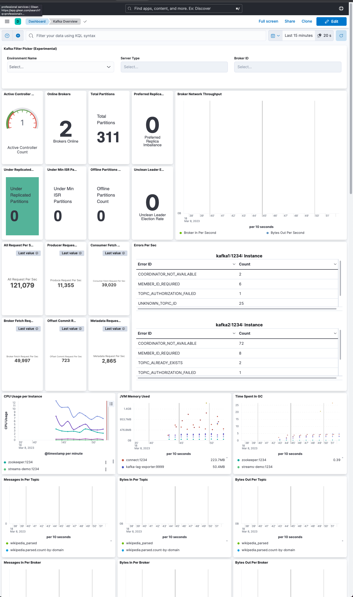
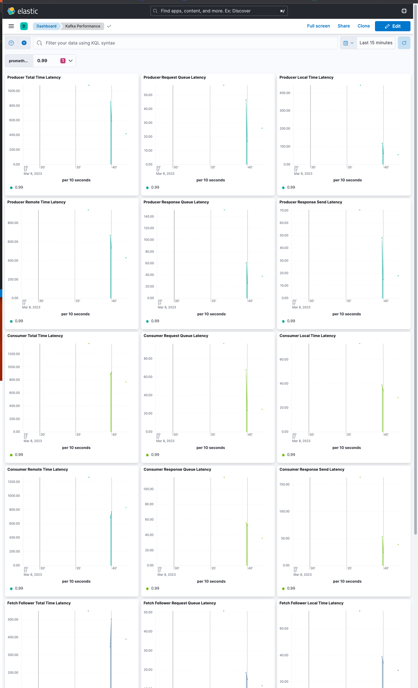
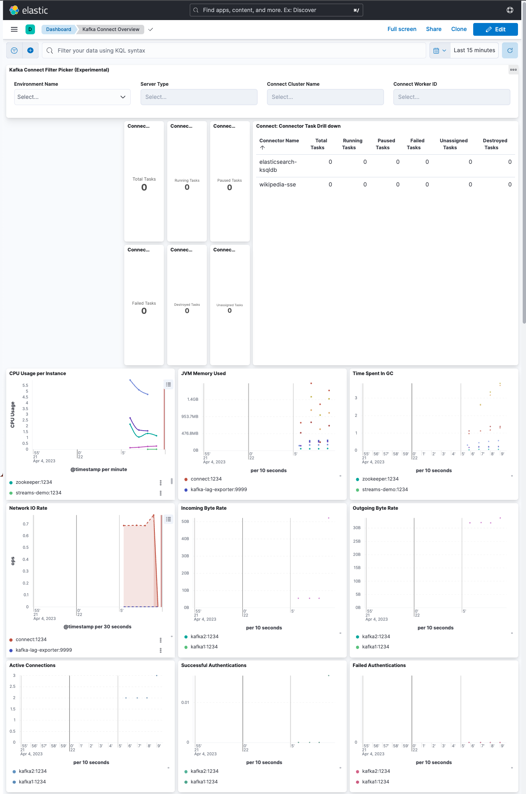
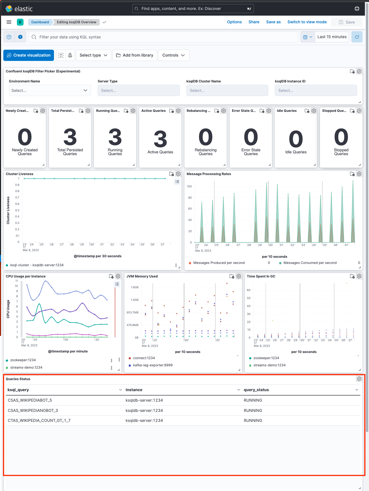

# Metricbat Elastic Search Kibana stack
## Elastic Search, Kibana and Metricbeat configurations
Override Metricbat Elastic Search Kibana images and configurations with versions of your choice in `docker-compose.override.yaml` 

## Kibana dashboards
### Kafka overview



### Kafka performance



### Kafka connect



### ksqlDB overview




## Integration Metricbeat and JMX Endpoints
Configure Metricbeat to scrap metrics from JMX Endpoints
Metricbeat config: [metricbeat/metricbeat.yml](./assets/metricbeat/metricbeat.yml)

```
metricbeat.modules:
  #------------------------- Node-Exporter Module ---------------------
  - module: prometheus
    period: 60s
    metricsets: ["collector"]
    hosts: ["node-exporter:9100"]
    metrics_path: /metrics
    fields_under_root: true
    fields:
      job_name: "node-exporter"

  #--------------------- Zookeeper Servers Module ---------------------
  - module: prometheus
    period: 60s
    metricsets: ["collector"]
    hosts: ["zookeeper:1234"]
    metrics_path: /metrics
    fields_under_root: true
    fields:
      env: "dev"
      job_name: "zookeeper"

  #----------------------- Kafka Servers Module -----------------------
  - module: prometheus
    period: 60s
    metricsets: ["collector"]
    hosts: ["kafka1:1234", "kafka2:1234"]
    metrics_path: /metrics
    fields_under_root: true
    fields:
      env: "dev"
      job_name: "kafka"

  #----------------------- Kafka Connect Module -----------------------
  - module: prometheus
    period: 60s
    metricsets: ["collector"]
    hosts: ["connect:1234"]
    metrics_path: /metrics
    fields_under_root: true
    fields:
      env: "dev"
      job_name: "connect"
      cluster: "cluster1"

  #----------------------- Kafka Streams Module -----------------------
  - module: prometheus
    period: 60s
    metricsets: ["collector"]
    hosts: ["streams-demo:1234"]
    metrics_path: /metrics
    fields_under_root: true
    fields:
      env: "dev"
      job_name: "streams-demo"

  #----------------- Confluent Schema Registry Module -----------------
  - module: prometheus
    period: 60s
    metricsets: ["collector"]
    hosts: ["schemaregistry:1234"]
    metrics_path: /metrics
    fields_under_root: true
    fields:
      env: "dev"
      job_name: "schemaregistry"

  #--------------------- Confluent KSQLDB Module ----------------------
  - module: prometheus
    period: 60s
    metricsets: ["collector"]
    hosts: ["ksqldb-server:1234"]
    metrics_path: /metrics
    fields_under_root: true
    fields:
      env: "dev"
      job_name: "ksqldb"
      cluster: "ksqldb-cluster-1"

  #-------------------- Confluent REST Proxy Module -------------------
  - module: prometheus
    period: 60s
    metricsets: ["collector"]
    hosts: ["restproxy:1234"]
    metrics_path: /metrics
    fields_under_root: true
    fields:
      env: "dev"
      job_name: "restproxy"

  #----------------------- Kafka Lag Exporter Module ------------------
  - module: prometheus
    period: 60s
    metricsets: ["collector"]
    hosts: ["kafka-lag-exporter:9999"]
    metrics_path: /metrics
    fields_under_root: true
    fields:
      env: "dev"
      job_name: "kafka-lag-exporter"
```